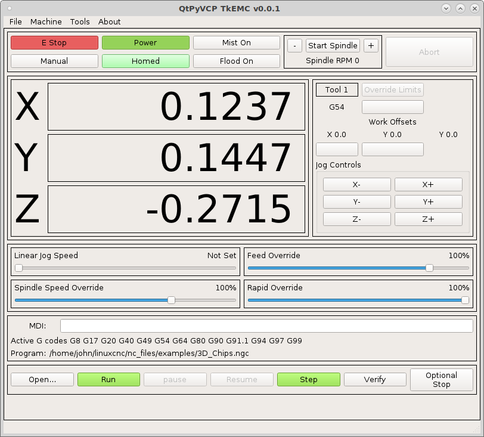

# tkemc
QtPyVCP GUI similar to the old TkEMC GUI

Requires `QtPyVCP <https://qtpyvcp.kcjengr.com/`_ to be installed and working.

Clone with ``git clone https://github.com/jethornton/tkemc.git``

To install and be able to edit open a terminal in the bp_touch directory and do
``pip install -e .``

To test with a simulated configuration copy the tkemc directory from the
configs directory to your linuxcnc/configs directory.

To update just do a ``git pull`` from the bp_touch directory.

